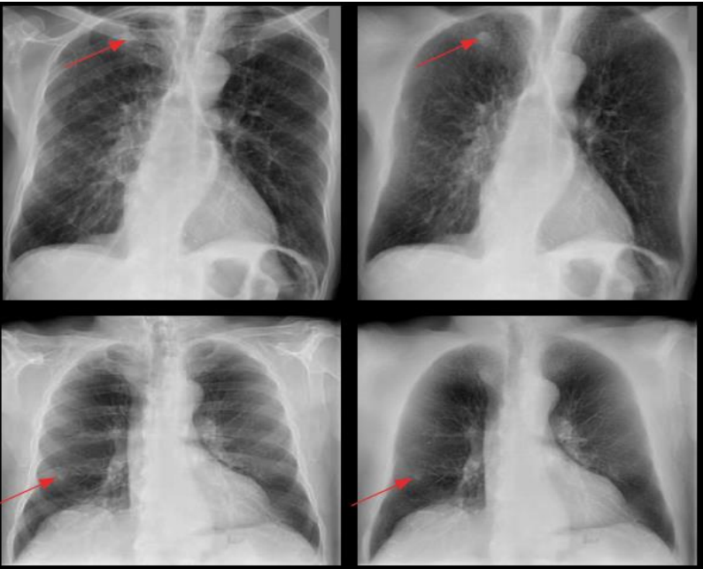

# Bone-supression-models
This repository contains the implementation and deployment of various Deep learning models for obtaining bone suppression images in chest x-ray images. Gradually new models will be added.

# Dataset
To train the models forced a public data set available on the kaggle platform [here](https://www.kaggle.com/datasets/hmchuong/xray-bone-shadow-supression). 
Bone suppression images were obtained using the Dual energy subtraction technique. They have a resolution of 1024x1024. The dataset has two versions of the data, one version contains 4080 pairs of chest x-ray images and their corresponding bone suppression image, the other contains 241 pairs of original images without any data augmentation technique.

# Training
The preprocessing and training routine for each specific model is distributed in different jupyter notebooks in the training scripts folder.

# Models
The models folder contains the deployed models. The models are available through a url contained in the [model.txt](models/models.txt) file. So far two models are available.
unet_resnet50: Based on a unet architecture with a pretrained resnet50 as encoder and a single channel attention technique.
gan_mso2: Model based on a pix2pix GAN architecture.

# Requirements
Each implemented model has its own requirements. The model requirement folder contains several .txt files where the requirements of each model are described. The [app_requirement.txt](app_requirements.txt.txt) file contains the requirements for the model deployment script.
#### Deployment script requirements
1. gradio
2. opencv-python-headless
3. fastai
4. numpy
5. tensorflow

# Try the models
The models can be used by running the [app.py](app.py) script. This script displays a gradio interface that makes it easy to test the deployed models. You must have previously downloaded the models you want to test through the [model.txt](models/models.txt) file.
