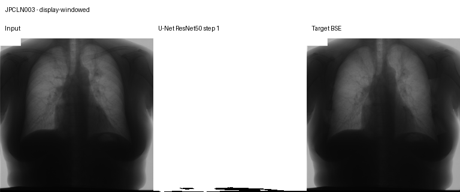
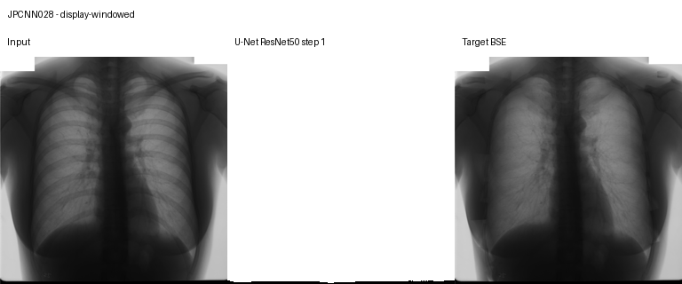
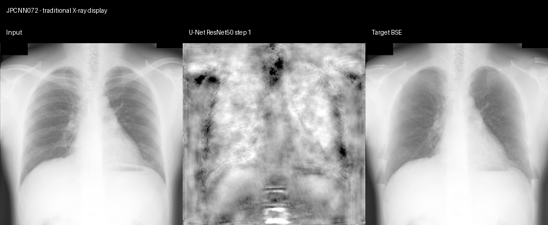

# Bone Suppression Models

Research-oriented tooling for generating bone-suppressed chest X-ray images with deep learning
models. The project now includes reproducible dataset splitting, Kaggle retraining commands,
GPU evaluation utilities, CPU-capable inference, and transparent model metadata.

Retrained-v1 visual examples are stored in `docs/assets/examples/retrained_v1/` and are generated
from the deterministic test split. The historical static visual remains in the repository for
provenance only and is no longer presented as benchmark evidence.

## Why Bone Suppression?

Ribs and clavicles can obscure lung findings in frontal chest radiographs. Bone suppression models
aim to synthesize a soft-tissue-like image that reduces high-contrast bone structures while
preserving clinically relevant lung texture. This repository provides a reproducible training and
inference layer for two model families:

- `gan_mso2`: a Pix2Pix-style conditional GAN for bone suppression.
- `unet_resnet50`: a FastAI U-Net with a pretrained ResNet50 encoder.

## Solution Approach

The repository is organized as a reproducible research package rather than only an inference
wrapper:

1. Pair the original `JSRT/JSRT` inputs with `BSE_JSRT/BSE_JSRT` targets from the Kaggle dataset.
   The primary metrics use only non-augmented images to avoid leakage.
2. Create a deterministic 70/15/15 train/validation/test split with seed `2026`. The split is
   saved as `splits.json` and reused by training, evaluation, and example generation.
3. Retrain both model families on Kaggle P100: TensorFlow/Keras for `gan_mso2` and FastAI/PyTorch
   for `unet_resnet50`. Augmentation is applied on the fly to train images only.
4. Evaluate both checkpoints on the fixed test split with autoregressive inference steps
   `0,1,2,3,4,5`. Step `0` is the input baseline; each later step feeds the previous output back
   into the model. The documented operating point is selected from the measured sweep, while the
   full step table remains available in `docs/results/`.
5. Export checkpoints, SHA256 checksums, manifests, metrics, and fixed visual examples. Large
   checkpoint files stay out of Git and are referenced through the model registry.
6. Keep user inference CPU-compatible with `--device cpu` and `device="cpu"`. Benchmark metrics are
   generated on Kaggle GPU for speed, but deployed inference does not require a GPU.

## Repository Structure

```text
src/bone_suppression/       Reusable Python package for training, evaluation, inference, and UI
configs/model_registry.json Model metadata, checkpoint links, metrics, examples, and availability
docs/                       Research, dataset, training, evaluation, and development documentation
docs/assets/examples/       Documentation images and retrained-v1 generated panels
notebooks/                  Kaggle retraining notebook
requirements/               Base, development, and model-specific dependency files
tests/                      Unit and smoke tests
models/                     Local checkpoint instructions; large weights are ignored by Git
```

## Quickstart

```bash
python -m pip install --upgrade pip
python -m pip install -e ".[dev]"
```

After retraining, download a checkpoint listed in `configs/model_registry.json` and place it under
`models/checkpoints/` or any local path outside Git history.

Run the interactive demo:

```bash
python app.py
```

Run single-image CPU inference from the command line:

```bash
bone-suppression \
  --model gan_mso2 \
  --checkpoint models/checkpoints/gan_mso2_retrained_v1.keras \
  --input path/to/chest-xray.png \
  --output outputs/bone-suppressed.png \
  --steps 2 \
  --device cpu
```

## Dataset

The workflow uses the public Kaggle dataset
[Chest Xray Bone Shadow Suppression](https://www.kaggle.com/datasets/hmchuong/xray-bone-shadow-supression).
It contains paired chest X-ray and dual-energy subtraction bone-suppressed images. Dataset files are
not redistributed here.

See [docs/dataset.md](docs/dataset.md) for access notes, split policy, preprocessing assumptions,
and research-use considerations.

## Models And Reproducibility

The canonical model registry is [configs/model_registry.json](configs/model_registry.json).

| Model key | Framework | Status |
| --- | --- | --- |
| `gan_mso2` | TensorFlow/Keras | Retrained-v1 pipeline ready; public Drive checkpoint pending |
| `unet_resnet50` | FastAI | Retrained-v1 pipeline ready; public Drive checkpoint pending |

The Kaggle notebook is
[notebooks/kaggle_retrain_bone_suppression.ipynb](notebooks/kaggle_retrain_bone_suppression.ipynb).
It creates a deterministic 70/15/15 split with seed `2026`, trains both models, evaluates
autoregressive steps on Kaggle GPU, and writes checkpoints, metrics, manifests, and visual
comparison panels.

## Results

Retrained-v1 metrics below are measured on the deterministic test holdout using Kaggle GPU
evaluation with `device=auto`. The selected step is the best MAE/SSIM operating point from the
documented `0,1,2,3,4,5` autoregressive sweep.

| Model | Step | MAE | RMSE | PSNR | SSIM | GPU sec/image |
| --- | ---: | ---: | ---: | ---: | ---: | ---: |
| `gan_mso2` retrained v1 | 1 | 0.011330 | 0.046331 | 27.456801 | 0.749001 | 0.108497 |
| `unet_resnet50` retrained v1 | 1 | 0.003033 | 0.034316 | 36.057932 | 0.874740 | 0.635685 |

## Best Model Examples

The best quantitative retrained-v1 checkpoint is `unet_resnet50` at autoregressive step `1`.
The examples below come from the deterministic test split and show the input X-ray, the one-step
model output, and the paired BSE target used for evaluation.







See [docs/training.md](docs/training.md), [docs/evaluation.md](docs/evaluation.md),
[docs/results.md](docs/results.md), and [docs/provenance.md](docs/provenance.md).

## Development

```bash
python -m pip install -e ".[dev]"
ruff check .
pytest
```

The test suite avoids requiring large model files. Framework-specific inference paths are smoke
tested with mocked models, while retraining commands import TensorFlow/FastAI only when invoked.

## Limitations

- This repository is for research and engineering experimentation, not clinical diagnosis.
- Large checkpoints and datasets must remain outside Git history.
- Public Drive links are placeholders until the final upload; SHA256 values and metrics are already
  recorded for retrained-v1.

## License

This project is released under the Apache License 2.0. See [LICENSE](LICENSE).
