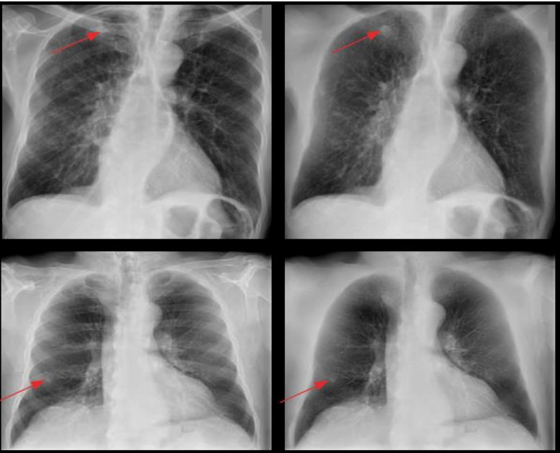

# Bone Suppression Models

Research-oriented tooling for generating bone-suppressed chest X-ray images with deep
learning models. The project focuses on reproducible inference, transparent model metadata,
and clear documentation for experimentation.



*Static visual example from the original project assets. Reproducible generated examples should
only be published after the required checkpoints have been downloaded and validated locally.*

## Why Bone Suppression?

Ribs and clavicles can obscure lung findings in frontal chest radiographs. Bone suppression
models aim to synthesize a soft-tissue-like image that reduces high-contrast bone structures
while preserving clinically relevant lung texture. This repository provides the deployment and
documentation layer for two early model families:

- `gan_mso2`: a Pix2Pix-style conditional GAN checkpoint for bone suppression.
- `unet_resnet50`: a FastAI U-Net with a pretrained ResNet50 encoder. The historical checkpoint
  link currently returns `404`, so this model is documented but not presented as reproducible.

## Repository Structure

```text
src/bone_suppression/       Reusable Python package for inference and UI
configs/model_registry.json Model metadata, checkpoint links, and availability status
docs/                       Research and development documentation
docs/assets/examples/       README and documentation images
requirements/               Base, development, and model-specific dependency files
tests/                      Unit and smoke tests
models/                     Local checkpoint instructions; large weights are ignored by Git
```

## Quickstart

```bash
python -m pip install --upgrade pip
python -m pip install -e ".[dev]"
```

Download a checkpoint listed in `configs/model_registry.json` and place it under
`models/checkpoints/` or any local path outside Git history.

Run the interactive demo:

```bash
python app.py
```

Run single-image inference from the command line:

```bash
bone-suppression \
  --model gan_mso2 \
  --checkpoint models/checkpoints/gan_mso2.h5 \
  --input path/to/chest-xray.png \
  --output outputs/bone-suppressed.png \
  --steps 2
```

## Dataset

The original work references the public Kaggle dataset
[Chest Xray Bone Shadow Suppression](https://www.kaggle.com/datasets/hmchuong/xray-bone-shadow-supression).
It contains paired chest X-ray and dual-energy subtraction bone-suppressed images, including a
larger augmented split and a smaller non-augmented split. Dataset files are not redistributed here.

See [docs/dataset.md](docs/dataset.md) for access notes, preprocessing assumptions, and research-use
considerations.

## Models And Reproducibility

The canonical model registry is [configs/model_registry.json](configs/model_registry.json).

| Model key | Framework | Status |
| --- | --- | --- |
| `gan_mso2` | TensorFlow/Keras | Checkpoint link opens; validate locally before reporting results |
| `unet_resnet50` | FastAI | Historical checkpoint link returns `404`; weights pending |

See [docs/models.md](docs/models.md) and [docs/inference.md](docs/inference.md) for model behavior,
checkpoint handling, and known limitations.

## Development

```bash
python -m pip install -e ".[dev]"
ruff check .
pytest
```

The test suite avoids requiring large model files. Framework-specific inference paths are smoke
tested with mocked models so the package can be checked in continuous integration.

## Limitations

- This repository is for research and engineering experimentation, not clinical diagnosis.
- Quantitative performance metrics are not included yet.
- Large checkpoints and datasets must be obtained separately.
- The static README visual is illustrative; it is not a freshly generated benchmark output.

## License

This project is released under the Apache License 2.0. See [LICENSE](LICENSE).
